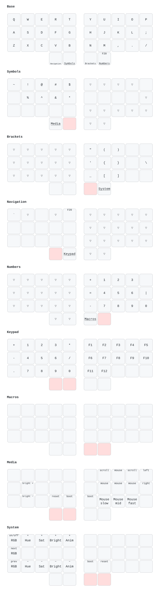

# sz keymap for the Aurora Sweep

Aligned with the gil (ZMK) keymap; `docs/layout.html` in gil compares the two.

* `./build.sh` builds the firmware.
* `./flash.sh` builds it and flashes both halves, prompting for each.
* `./draw.sh` redraws `keymap-drawer/sweep.svg` with [keymap-drawer], using
  the same labels as gil's drawing.

Both set up what they need on first use: Homebrew's `avr-gcc@8` and
`dfu-programmer`, a Python environment in `.venv` with this checkout's
requirements, and the `lib/lufa` and `lib/printf` submodules.

Text macros (layer 6) take their text from `$KB_MACRO_<NAME>`, or else from
`macros/<name>.txt`. Neither is committed; see `macro_text.py`.

[keymap-drawer]: https://github.com/caksoylar/keymap-drawer
